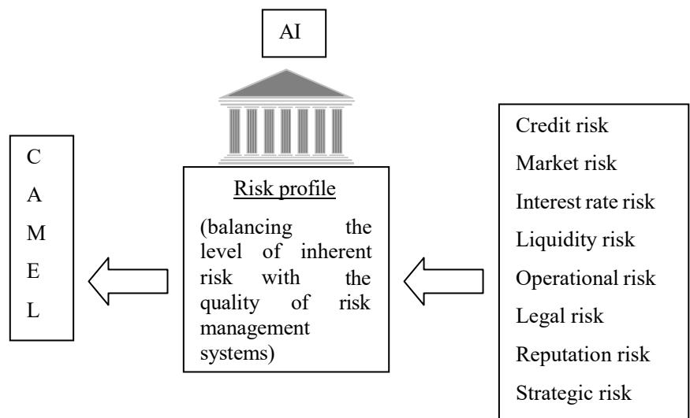
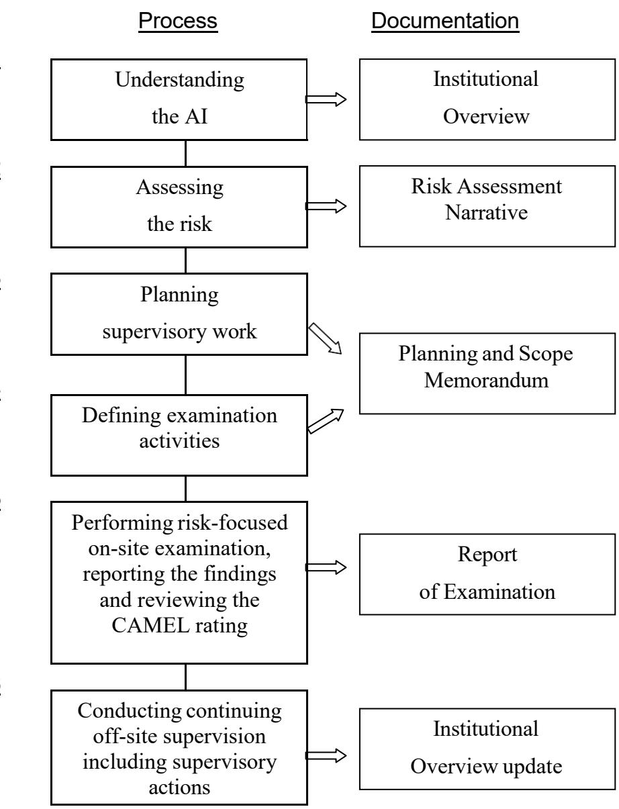
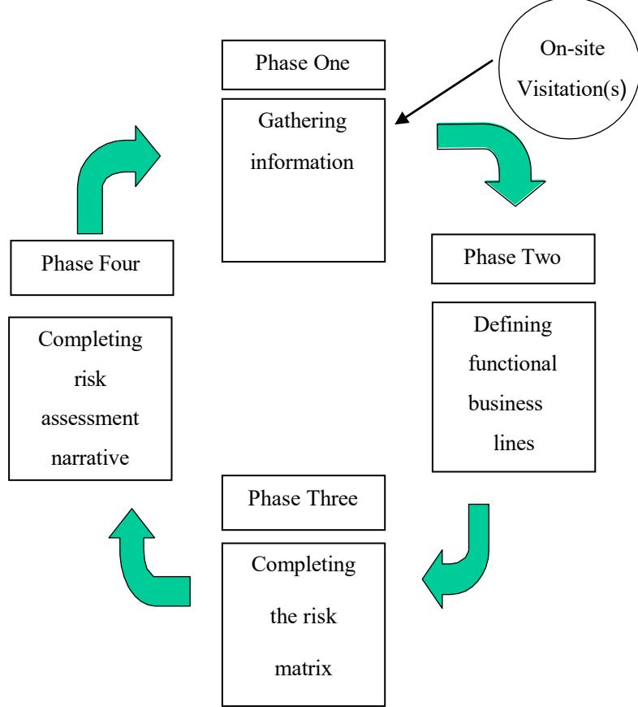
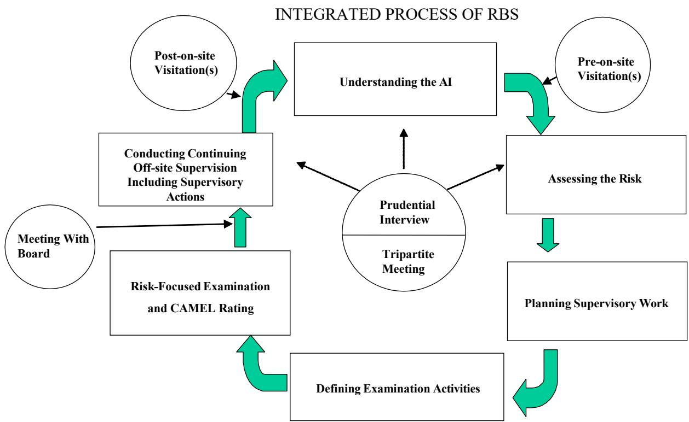
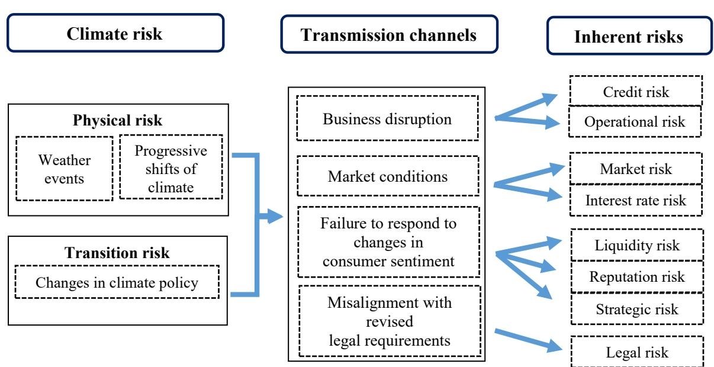

<table><tr><td colspan="3">HoNG KoNG MoNETARY AUTHORITY</td></tr><tr><td colspan="3">香港金融管理局</td></tr><tr><td colspan="2">Supervisory Policy Manual</td><td></td></tr><tr><td>SA-1</td><td>Risk-based Supervisory Approach</td><td>V.2-23.12.2022</td></tr></table>

This module should be read in conjunction with the Introduction and with the Glossary, which contains an explanation of abbreviations and other terms used in this Manual. If reading on-line, click on blue underlined headings to activate hyperlinks to the relevant module.

# Purpose

To explain the HKMA's risk-based supervisory approach

# Classification

A non-statutory guideline issued by the MA as a guidance note

Previous guidelines superseded

SA-1 “Risk-based Supervisory Approach” (V.1) dated 11.10.01

# Application

To all AIs

# Structure

1. Supervisory framework

1.1 Introduction   
1.2 Key benefits   
1.3 Integration with CAMEL rating system   
1.4 Risk-based approach and methodology   
1.5 Risk assessment   
1.6 Supervisory process   
1.7 Primary prudential obligations of an AI

2. The eight types of inherent risk

2.1 Credit risk   
2.2 Market risk   
2.3 Interest rate risk   
2.4 Liquidity risk   
2.5 Operational risk   
2.6 Reputation risk   
2.7 Legal risk   
2.8 Strategic risk   
2.9 Emerging risk types

<table><tr><td colspan="3">HoNG KoNG MoNETARY AUTHORITY</td></tr><tr><td colspan="3">香港金融管理局</td></tr><tr><td colspan="2">Supervisory Policy Manual</td><td></td></tr><tr><td>SA-1</td><td>Risk-based Supervisory Approach</td><td>V.2-23.12.2022</td></tr></table>

3. Four elements of a sound risk management system

3.1 Summary   
3.2 Board and senior management oversight   
3.3 Policies, procedures and limit structure   
3.4 Risk measurement, monitoring and management   
reporting systems   
3.5 Internal controls and comprehensive audits

4. Rating risk management

4.1 Factors considered   
4.2 Rating scale and integration into CAMEL rating   
4.3 Definitions of risk management ratings

# 1. Supervisory framework

# 1.1 Introduction

1.1.1 The objective of the supervisory framework of the HKMA is to provide an effective process to monitor and assess the safety and soundness of AIs on a continuing basis. The process follows a risk-based approach. It consists of a structured methodology designed to establish a forward-looking view on the risk profile of AIs. This permits a direct and specific focus on the areas of greatest risk to an AI. It also enables the HKMA to be more proactive and better positioned to pre-empt any serious threat to the stability of the banking system from any current or emerging risks.

<table><tr><td colspan="3">HoNG KoNG MoNETARY AUTHORITY</td></tr><tr><td colspan="3">香港金融管理局</td></tr><tr><td colspan="2">Supervisory Policy Manual</td><td></td></tr><tr><td>SA-1</td><td>Risk-based Supervisory Approach</td><td>V.2-23.12.2022</td></tr></table>

1.1.2 The adoption of a well-structured risk-based framework allows the HKMA to continue to deliver consistent, highquality supervision as the banking sector develops and risk profiles of AIs change in reaction to competitive forces. This should also benefit AIs as regulatory effort is focused on high-risk areas warranting management attention.

# 1.2 Key benefits

1.2.1 The key benefits for both the HKMA and AIs from this riskbased supervisory framework are:

better evaluation of risks through separate assessment of inherent risks and risk management processes;   
greater emphasis on early identification of emerging risks at individual AIs and on a sectorwide basis;   
cost-effective use of resources through a sharper focus on risks, which in time should result in examination teams spending less time on site at individual AIs;   
more utilisation by the HKMA of management information prepared by AIs;   
a better appreciation by supervisors of the management quality of AIs, the characteristics of their business and the risks they face;   
enhanced value of the supervisory work performed to both the management of AIs and the supervisors, who have a common interest in ensuring that risks are properly identified and that adequate and effective control systems are established to monitor and control risks; and

cost of supervision, in terms of management time of an AI, will be more directly related to the AI’s risk profile, i.e. the intensity of supervision and the amount and focus of supervisory action will increase or decrease in line with the perceived risk profile of the AI.

<table><tr><td colspan="3">HoNG KoNG MoNETARY AUTHORITY</td></tr><tr><td colspan="3">香港金融管理局</td></tr><tr><td colspan="2">Supervisory Policy Manual</td><td></td></tr><tr><td>SA-1</td><td>Risk-based Supervisory Approach</td><td>V.2-23.12.2022</td></tr></table>

# 1.3 Integration with CAMEL rating system

1.3.1 The CAMEL 1 rating system, which has been implemented at the HKMA since 1995, is designed to assess in a comprehensive manner an AI’s financial condition, compliance with laws and regulations, risk management systems and overall operating soundness. Its primary purpose is to help identify those AIs where weaknesses in the aforementioned areas require special supervisory attention or warrant a higher than normal degree of supervisory concern.

1.3.2 Risk-based supervision is a dynamic and forward-looking approach, which provides the supervisory process with the necessary framework to factor the risk profile of an AI into the CAMEL rating system. Risk-taking has always been present in the banking business, and rightfully so, but has increased significantly, primarily due to the need to remain competitive in a fast-paced environment.

1.3.3 The risk-based methodology incorporates the risk profile, which is ascertained by balancing the level of inherent risk with the quality of risk management systems at AIs, into the CAMEL rating system. Each of the CAMEL components is, as shown in the following diagram, affected by one or more of the eight inherent risks (credit, market, interest rate, liquidity, operational, legal, reputation and strategic), which the HKMA has identified as risks to be assessed during the supervisory process. These eight inherent risks are described in section 2 below.

<table><tr><td colspan="3">HoNG KoNG MoNETARY AUTHORITY</td></tr><tr><td colspan="3">香港金融管理局</td></tr><tr><td colspan="2">Supervisory Policy Manual</td><td></td></tr><tr><td>SA-1</td><td>Risk-based Supervisory Approach</td><td>V.2-23.12.2022</td></tr></table>

1.3.4 Under the risk-based approach, a change in the CAMEL rating of an AI may result from the qualitative analysis of its risk profile in addition to the more traditional quantitative analysis of its financial data. An example of such a change would be a down-grade in asset quality to a "3" for an AI which displays current indicators representing an asset quality of "2" but whose credit risk, as a result of recent aggressive lending practices and less than satisfactory credit risk management systems, has been assessed as high.

1.3.5 This approach to supervision does not eliminate or change the quantitative approach to assessing the components of the CAMEL rating system but it adds a new dimension, which enables the supervisory process to inject more judgement, based on a forward perspective, in arriving at a final rating.

1.3.6 The risk-focused examination process places more emphasis on an evaluation of the quality of risk management systems and internal controls. A risk management rating is assigned taking into account the results of the on-site examination and formally incorporated into the management component of the CAMEL rating. It may also influence the ratings given to the other CAMEL components, as illustrated in para. 1.3.4 above. Section 3 below gives details of the four elements of a sound risk management system and section 4 describes the risk management rating system.

<table><tr><td colspan="3">HoNG KoNG MoNETARY AUTHORITY</td></tr><tr><td colspan="3">香港金融管理局</td></tr><tr><td colspan="2">Supervisory Policy Manual</td><td></td></tr><tr><td>SA-1</td><td>Risk-based Supervisory Approach</td><td>V.2-23.12.2022</td></tr></table>

# 1.4 Risk-based approach and methodology

1.4.1 The risk-based supervisory approach, which emphasises effective planning and examiner judgement, customises examinations to suit the size and activities of AIs and to concentrate examiner resources on areas that expose the AI concerned to the greatest degree of risk.

1.4.2 The risk-based methodology, shown in the diagram below, consists of six key steps.

<table><tr><td colspan="3">HoNG KoNG MoNETARY AUTHORITY</td></tr><tr><td colspan="3">香港金融管理局</td></tr><tr><td colspan="2">Supervisory Policy Manual</td><td></td></tr><tr><td>SA-1</td><td>Risk-based Supervisory Approach</td><td>V.2-23.12.2022</td></tr></table>

# Step 6

1.4.3 The first step in the risk-based methodology, Understanding the AI, requires the preparation of an Institutional Overview document.

1.4.4 The Institutional Overview provides a concise portrait of an AI’s structure and financial condition. It summarises key business lines and functions, the business strategy and any planned introduction of new products, describes legal structure and financial condition and identifies problem issues related to the AI itself or its affiliated entities, such as domestic or foreign subsidiaries and

<table><tr><td colspan="3">HoNG KoNG MoNETARY AUTHORITY</td></tr><tr><td colspan="3">香港金融管理局</td></tr><tr><td colspan="2">Supervisory Policy Manual</td><td></td></tr><tr><td>SA-1</td><td>Risk-based Supervisory Approach</td><td>V.2-23.12.2022</td></tr></table>

branches.

1.4.5 Information provided in the Institutional Overview is determined by the complexity of the AI and is primarily based upon internal and public sources of data, as well as information gathered from on-site visitations.

1.4.6 The second step in the risk-based methodology, Assessing the Risk, results in the completion of a Risk Assessment Narrative.

1.4.7 The risk assessment exercise is designed to identify the type, level and direction of risks of an AI.

1.4.8 In order to conduct this exercise effectively, a buildingblock approach is used in which each of the significant activities of the AI is assessed with respect to the level of each of the inherent risks and the risk management systems in place to manage these risks.

1.4.9 The objective of the risk assessment exercise is to develop a comprehensive risk profile, which captures all the eight types of inherent risks of the AI. Subsection 1.5 below describes the risk assessment process in more detail.

1.4.10 The risk profile is used to complete the third and fourth steps in the risk-based methodology, which are Planning the Supervisory Work and Defining Examination Activities. The document to be prepared for these two steps is the Planning and Scope Memorandum. The HKMA will try to customise examination tasks so that they are consistent with the complexity and risk profile of the AI.

1.4.11 The emphasis of the risk-focused examination to be performed in step five is on evaluating the effectiveness of the risk management system of the AI for each type of inherent risks. As previously indicated in para. 1.3.6, a risk management rating is assigned taking into account the on-site examination results, and factored into the management component of the CAMEL rating. The risk management rating may also affect the rating for one or more of the other CAMEL components. A report of examination will then be produced in this step to capture the examination findings and results from the review of the

<table><tr><td colspan="3">HoNG KoNG MoNETARY AUTHORITY</td></tr><tr><td colspan="3">香港金融管理局</td></tr><tr><td colspan="2">Supervisory Policy Manual</td><td></td></tr><tr><td>SA-1</td><td>Risk-based Supervisory Approach</td><td>V.2-23.12.2022</td></tr></table>

CAMEL rating.

1.4.12 As the risk-based supervisory methodology revolves around a process of continuing off-site supervision, the Institutional Overview produced in step one will be constantly updated throughout the year in step six, making it a dynamic document which always reflects the most current position of the AI.

# 1.5 Risk assessment

1.5.1 The development of a formal risk assessment process represents an important addition to the HKMA's supervisory approach. The purpose of this risk assessment undertaking is, as indicated earlier, to identify the type, level and direction of all significant risks of an AI. The process consists of determining the level of risk in each of the eight inherent risks by business activity, the direction of risk, the adequacy of existing risk management systems and the impact, if any, of external risk factors. It concludes with a composite risk level for each business activity and an overall risk profile for the AI.

1.5.2 The level of inherent risk is defined as the probability and degree of potential loss due to an adverse event or action within a particular activity or product without regard to the adequacy and quality of the relevant risk management system in place. Ascertaining the level of inherent risk is a judgement call after assessing and weighing all the factors and evaluation criteria for each of the inherent risks. For example, if the asset quality of the loan portfolio being assessed has deteriorated to a less than satisfactory rating with a high level of classified credits, the level of inherent credit risk will probably be rated as high.

1.5.3 The adequacy of risk management systems is determined by evaluating the four elements of a sound risk management system as follows:

active Board and senior management oversight; effective organisational policies, procedures and limits for managing business activities; adequate risk measurement, monitoring and management reporting systems; and comprehensive internal controls, including an effective internal audit function.

<table><tr><td colspan="3">HoNG KoNG MoNETARY AUTHORITY</td></tr><tr><td colspan="3">香港金融管理局</td></tr><tr><td colspan="3">Supervisory Policy Manual</td></tr><tr><td>SA-1</td><td>Risk-based Supervisory Approach</td><td>V.2-23.12.2022</td></tr></table>

1.5.4 The following eight inherent risks which have been identified by the HKMA are to be assessed during this process:

 credit;   
 market;   
 interest rate;   
 liquidity;   
 operational;   
 legal;   
 reputation; and  strategic.

1.5.5 New risk types may emerge from time to time. Many of these new risk types can have implications for one or more of the eight inherent risks mentioned above. Exposures to these risk types should therefore be considered in the assessment of the above eight inherent risks as illustrated in section 2 below.

<table><tr><td colspan="3">HoNG KoNG MoNETARY AUTHORITY</td></tr><tr><td colspan="3">香港金融管理局</td></tr><tr><td colspan="2">Supervisory Policy Manual</td><td></td></tr><tr><td>SA-1</td><td>Risk-based Supervisory Approach</td><td>V.2-23.12.2022</td></tr></table>

1.5.6 The risk assessment exercise consists of four phases as shown in the following diagram:

1.5.7 In phase one, sufficient information must be gathered to understand fully the business activities and risk management systems of the AI. This can be accomplished by conducting one or more on-site visitations to the AI to obtain the required information or to clarify information already received.

1.5.8 In phase two, functional business lines and the relative significance of activities are properly identified. In identifying functional businesses, the HKMA will adopt as far as possible the AI's own classification of its different businesses, since the internal management information reports are likely to be compiled on the same basis. Use of the AI's own classification will usually facilitate the HKMA's analysis and assessment.

1.5.9 There are four steps involved in phase three. The initial step is to identify the level of inherent risk by functional activity for each of the eight inherent risks. The level of inherent risk, which is a judgement call by the case officer, can be assessed as "high", "moderate" or "low". Qualitative as well as quantitative factors will be considered for each functional activity in arriving at the judgement. Generally speaking, based on the statistical theory of probability, moderate inherent risk exists when there is an average probability or chance of an adverse impact on an AI’s capital or earnings due to exposure and uncertainty from potential future events within the functional activity. An assessment of high inherent risk would reflect a higher than average probability of potential loss and an assessment of low inherent risk would reflect a lower than average probability. In arriving at the level of inherent risk, the degree of potential loss in relation to earnings and capital must also be considered and factored into the decision. High inherent risk could reasonably be expected to result in a significant and harmful loss to the AI. Moderate inherent risk could reasonably be expected to result in a loss, which could be absorbed by the AI in the normal course of business and low inherent risk could reasonably be expected to result in little or no loss to the AI. In assessing inherent risk, the direction of risk in the next 12 months, including the risk in any new products, must also be considered.

<table><tr><td colspan="3">HoNG KoNG MoNETARY AUTHORITY</td></tr><tr><td colspan="3">香港金融管理局</td></tr><tr><td colspan="2">Supervisory Policy Manual</td><td></td></tr><tr><td>SA-1</td><td>Risk-based Supervisory Approach</td><td>V.2-23.12.2022</td></tr></table>

1.5.10 The second step is to evaluate by functional activity the risk management systems in place to manage the inherent risks. The risk management systems will be assessed as "strong", "acceptable" or "weak" in the areas of management oversight, policies and procedures, risk measurement and internal controls, as mentioned earlier.

1.5.11 The third step in phase three is to classify the composite risk profile for each of the significant business activities as "low", "moderate" or "high". This is a summary judgement arrived at by balancing the level of inherent risks of the business activity, the adequacy of the risk management systems for the activity and the direction of risk.

1.5.12 The direction of risk is required so that the assessment of risk reflects a forward as well as current view of the composite risk profile of an AI for a particular activity. For this purpose, the direction of risk is classified as “increasing”, “stable” or “decreasing”.

<table><tr><td colspan="3">HoNG KoNG MoNETARY AUTHORITY</td></tr><tr><td colspan="3">香港金融管理局</td></tr><tr><td colspan="2">Supervisory Policy Manual</td><td></td></tr><tr><td>SA-1</td><td>Risk-based Supervisory Approach</td><td>V.2-23.12.2022</td></tr></table>

1.5.13 This means, for example, that if credit risk is the most significant risk for a particular activity conducted by an AI and it is increasing, that may prompt the HKMA to increase the composite risk profile for the activity in question (i.e. from “moderate” to “high”). If, however, the direction of credit risk is either stable or declining, it may not alter the composite risk profile for the activity concerned.

1.5.14 Since, however, the risk assessment process includes many judgemental considerations, it is also possible for the composite risk profile for an activity to be lowered under the same scenario of a stable or declining credit risk environment after taking into account other relevant factors. A risk profile matrix, which serves as a guide for ascertaining the composite risk profile for each significant activity and the appropriate supervisory response is set out below:

<table><tr><td colspan="3">HoNG KoNG MoNETARY AUTHORITY</td></tr><tr><td colspan="3">香港金融管理局</td></tr><tr><td colspan="2">Supervisory Policy Manual</td><td></td></tr><tr><td>SA-1</td><td>Risk-based Supervisory Approach</td><td>V.2-23.12.2022</td></tr></table>

Risk profile matrix2   

<table><tr><td rowspan=2 colspan=2></td><td rowspan=1 colspan=3>RISK MANAGEMENT SYSTEMS</td></tr><tr><td rowspan=1 colspan=1>STRONG</td><td rowspan=1 colspan=1>ACCEPTABLE</td><td rowspan=1 colspan=1>WEAK</td></tr><tr><td rowspan=3 colspan=1>INHERENTRISK</td><td rowspan=1 colspan=1>HIGH</td><td rowspan=1 colspan=1>Moderate to highaggregate riskLimited review</td><td rowspan=1 colspan=1>High aggregateriskLimited review</td><td rowspan=1 colspan=1>High aggregateriskFull-scopereview required</td></tr><tr><td rowspan=1 colspan=1>MODERATE</td><td rowspan=1 colspan=1>Low to moderateaggregate riskLimited or noreview required</td><td rowspan=1 colspan=1>Moderateaggregate riskLimited review</td><td rowspan=1 colspan=1>Moderateaggregate riskFull-scopereview required</td></tr><tr><td rowspan=1 colspan=1>LOW</td><td rowspan=1 colspan=1>Low aggregateriskNo reviewrequired</td><td rowspan=1 colspan=1>Low aggregateriskNo reviewrequired</td><td rowspan=1 colspan=1>Low aggregateriskLimited review</td></tr></table>

1.5.15 The final step in phase three is to develop a risk matrix summary, which shows the composite risk profile and direction of risk by each type of inherent risk across all business activities. The composite risk profile by inherent risk is arrived at by balancing the level of inherent risk with the quality of risk management systems and the direction of risk. The risk matrix summary also reflects an overall risk profile and direction of risk for the AI.

1.5.16 Phase four of the risk assessment process requires the completion of a risk assessment narrative document, which is an integral part of the entire risk-based supervisory methodology. The narrative shows the overall level of risk by inherent risk category and direction. It also analyses the business activities within each of the risk categories and evaluates qualitatively management's effectiveness in managing and controlling the risks. The document also identifies key issues that may affect the risk profile and contains details of the type and level of activity that was assessed. The risk assessment narrative is used to assist in determining the risk-focused examination scope.

<table><tr><td colspan="3">HoNG KoNG MoNETARY AUTHORITY</td></tr><tr><td colspan="3">香港金融管理局</td></tr><tr><td colspan="2">Supervisory Policy Manual</td><td></td></tr><tr><td>SA-1</td><td>Risk-based Supervisory Approach</td><td>V.2-23.12.2022</td></tr></table>

1.5.17 The goal of the risk assessment narrative is to develop an overall risk profile of an AI and provide the background to how the overall risk profile for the AI has been derived. The narrative should include a discussion of the AI's key risks, describe and assess how the AI manages the risks, detail the level and trend of the risks, document the areas of supervisory concern and provide an overall assessment of the organisation.

1.5.18 The risk assessment narrative will also include a discussion of the AI’s risk management rating, which is assigned taking into account the results of the riskfocused on-site examination. As previously indicated, the risk management rating is factored into the CAMEL rating of the AI. The narrative document will also include comments on the consolidated risk management system and the internal and external audit function.

<table><tr><td colspan="3">HoNG KoNG MoNETARY AUTHORITY</td></tr><tr><td colspan="3">香港金融管理局</td></tr><tr><td colspan="2">Supervisory Policy Manual</td><td></td></tr><tr><td>SA-1</td><td>Risk-based Supervisory Approach</td><td>V.2-23.12.2022</td></tr></table>

1.6 Supervisory process

1.6.1 The diagram above shows how the risk-based supervisory methodology has been integrated into the HKMA's overall supervisory process in a way that provides an enhanced level of continuous supervision. The risk-based approach, which by design is circular and conducted on as current a basis as possible in a continuing cycle, is complemented and strengthened by on-site visitations, prudential interviews, annual tripartite meetings and annual supervisory meetings with the Board of Directors of locally incorporated banks.

1.6.2 On-site visitations to AIs may be conducted at any phase of the cycle but are more likely to take place during the updating of the risk assessment process prior to the start of, or subsequent to, the on-site examination. The purpose of the "pre-on-site" visitation is usually to obtain a current picture of recent developments, which may have an effect on the risk profile of the AI, such as the introduction of new products or any significant changes in the risk management systems. Case officers are required to perform an assessment of the internal audit function of an AI. The assessment includes a review of the internal audit’s independence and performance. The results of the assessment will be used to decide the scope for the risk- focused on-site examination. If the internal audit function is acceptable and meets the HKMA’s standards, the HKMA will be able to place more reliance on its work and the scope for the on-site examination can be suitably reduced. The "post-on-site" visitation can be conducted to follow up on the status of any significant examination findings or supervisory actions instituted.

<table><tr><td colspan="3">HoNG KoNG MoNETARY AUTHORITY</td></tr><tr><td colspan="3">香港金融管理局</td></tr><tr><td colspan="2">Supervisory Policy Manual</td><td></td></tr><tr><td>SA-1</td><td>Risk-based Supervisory Approach</td><td>V.2-23.12.2022</td></tr></table>

1.6.3 As part of the continuous supervisory process, an annual prudential meeting is held with the senior management of an AI. The HKMA attaches great importance to this regular dialogue as it enables the supervisory officials to understand better how senior management views and controls the AI's risks and how it views the current business situation and future prospects. The meeting also provides the supervisors with an opportunity to clarify specific issues and discuss prudential concerns which have arisen during any phase of the cycle.

1.6.4 For AIs belonging to a banking group, prudential meetings may be held both at group level and with individual AIs of the group. In addition, the HKMA may hold discussions with overseas head offices of foreign banks, either through HKMA staff calling on them or during their visits to Hong Kong.

1.6.5 Annual tripartite meetings are held with AIs and their external auditors, normally following the completion of the annual audit. Matters discussed typically include any issues arising out of the audit such as weaknesses identified in internal controls, the adequacy of provisions and compliance with prudential standards and the various requirements of the Banking Ordinance. The

<table><tr><td colspan="3">HoNG KoNG MoNETARY AUTHORITY</td></tr><tr><td colspan="3">香港金融管理局</td></tr><tr><td colspan="2">Supervisory Policy Manual</td><td></td></tr><tr><td>SA-1</td><td>Risk-based Supervisory Approach</td><td>V.2-23.12.2022</td></tr></table>

HKMA will also wish to see the auditors’ management letter to the AI and discuss any matters of prudential concern contained in the letter.

.6.6 As a further enhancement to the continuous supervisory approach, the HKMA will hold an annual meeting with the Board of Directors of each locally-incorporated bank. This meeting will generally be conducted after the completion of the risk-focused on-site examination and updating of the composite CAMEL rating of the AI. The purpose of this meeting is generally to discuss the examination findings, particularly any significant deficiencies in the risk management systems or any other matters of prudential concern. The meeting can also be a forum for the Board members and the supervisory officials to discuss any matters of mutual interest.

# 1.7 Primary prudential obligations of an AI

1.7.1 AIs are expected to have in place a comprehensive risk management system to identify, measure, monitor and control the various types of risks within all of their activities and, where appropriate, to hold capital against these risks. AIs should have adequate policies, procedures, limits and controls to manage the eight types of inherent risk identified by the HKMA and any other risks which have been identified by the AI itself. Specialised board committees such as the audit committee, the risk management committee or the asset and liability management committee have a useful role to play in reviewing the adequacy of the risk management system and the extent of the overall effectiveness of it. AIs should ensure that the four elements of a sound risk management system are met (see para. 1.5.3).

1.7.2 The HKMA has issued various guidelines and guidance notes to the industry, which represent either minimum standards or in some cases best practices to be adopted by AIs. These guidelines and guidance notes can be found in the HKMA’s Supervisory Policy Manual. AIs are expected to have systems and procedures in place to ensure compliance with these guidelines and guidance

<table><tr><td colspan="3">HoNG KoNG MoNETARY AUTHORITY</td></tr><tr><td colspan="3">香港金融管理局</td></tr><tr><td colspan="2">Supervisory Policy Manual</td><td></td></tr><tr><td>SA-1</td><td>Risk-based Supervisory Approach</td><td>V.2-23.12.2022</td></tr></table>

notes as appropriate.

# 2. The eight types of inherent risk

# 2.1 Credit risk

2.1.1 This is the risk that a borrower or counterparty may fail to fulfill an obligation. The assessment of credit risk involves evaluating both the probability of default by the counterparty, obligor or issuer and the exposure or financial impact on the AI in the event of default.

# 2.2 Market risk

2.2.1 This is the risk to an AI's financial condition resulting from adverse movements in market rates or prices such as foreign exchange rates, commodity or equity prices. The primary determinant of the inherent market risk of a business line is the volatility of the relevant markets. In assessing inherent market risk one must consider, however, the interaction between market volatility and business strategy. A trading strategy that focuses exclusively on intermediation between end-users will tend to result in less market risk than a purely proprietary strategy.

# 2.3 Interest rate risk

2.3.1 This is the risk to an AI's financial condition resulting from adverse movements in interest rates. In determining the levels of interest rate risk, assessments are made of the levels of repricing risk, basis risk, options risk and yield curve risk. In addition, evaluations are made of the funding strategy with respect to interest rate movements and the impact of the overall business strategy on interest rate risk.

# 2.4 Liquidity risk

2.4.1 This is the risk that an AI may be unable to meet its obligations as they fall due. This may be caused by "funding liquidity risk", i.e. the AI's inability to liquidate assets or to obtain funding to meet its obligations. The problem could also be caused by "market liquidity risk", where the AI cannot easily unwind or offset specific exposures without lowering market prices significantly because of inadequate market depth or market disruptions.

<table><tr><td colspan="3">HoNG KoNG MoNETARY AUTHORITY</td></tr><tr><td colspan="3">香港金融管理局</td></tr><tr><td colspan="2">Supervisory Policy Manual</td><td></td></tr><tr><td>SA-1</td><td>Risk-based Supervisory Approach</td><td>V.2-23.12.2022</td></tr></table>

# 2.5 Operational risk

2.5.1 This is the risk of direct or indirect loss resulting from inadequate or failed internal processes, staff and systems or from external events.

2.5.2 The evaluation of operational risk involves an assessment of both product and AI-specific factors. The relevant product factors include the maturity of the product in the market, the need for significant fund movements, the impact of a breakdown in segregation of duties and the level of complexity and innovation in the market place. AI-specific factors, which can significantly increase or decrease the basic level of operational risk, include the quality of the audit function and programme, the volume of transactions in relation to systems development and capacity, the complexity of the processing environment and the level of manual intervention required to process transactions.

# 2.6 Reputation risk

2.6.1 This is the potential that negative publicity regarding an AI's business practices, whether true or not, will cause a decline in the customer base or lead to costly litigation or revenue reductions. Market rumours or public perceptions are significant factors in determining the level of risk in this category.

# 2.7 Legal risk

2.7.1 This is the risk arising from the potential that unenforceable contracts, lawsuits or adverse judgments may disrupt or otherwise negatively affect the operations or financial condition of an AI.

# 2.8 Strategic risk

2.8.1 This is the risk of current and prospective impacts on earnings, capital, reputation or standing arising from poor business decisions, improper implementation of decisions or lack of response to industry, economic or technological changes. This risk is a function of the compatibility of an organisation’s strategic goals, the business strategies developed to achieve these goals, the resources deployed to meet these goals and the quality of implementation.

<table><tr><td colspan="3">HoNG KoNG MoNETARY AUTHORITY</td></tr><tr><td colspan="3">香港金融管理局</td></tr><tr><td colspan="2">Supervisory Policy Manual</td><td></td></tr><tr><td>SA-1</td><td>Risk-based Supervisory Approach</td><td>V.2-23.12.2022</td></tr></table>

# 2.9 Emerging risk types

2.9.1 From time to time new risk types may emerge and can have implications for one or more of the eight inherent risks mentioned above. These risk types should therefore be considered in the assessment of the eight inherent risks.

2.9.2 One example is climate risk3. Climate risk may affect AIs’ exposures to multiple inherent risks. For instance, climate risk drivers may lead to business disruption affecting the repayment ability of borrowers, thereby increasing AIs’ exposure to credit risk. AIs may also face heightened reputation risk with changing market and consumer sentiment towards more climate or environmentally-friendly products, services and business practices. The diagram below illustrates some potential channels through which climate risk can translate into the eight inherent risks.

<table><tr><td colspan="3">HoNG KoNG MoNETARY AUTHORITY</td></tr><tr><td colspan="3">香港金融管理局</td></tr><tr><td colspan="2">Supervisory Policy Manual</td><td></td></tr><tr><td>SA-1</td><td>Risk-based Supervisory Approach</td><td>V.2-23.12.2022</td></tr></table>

# 3. Four elements of a sound risk management system

# 3.1 Summary

3.1.1 While risk management systems vary among AIs, there are four basic elements contributing to a sound risk management environment.

 active Board and senior management oversight; organisational policies, procedures and limits that have been developed and implemented to manage business activities effectively; adequate risk measurement, monitoring and management information systems that are in place to support all business activities; and   
 established internal controls and the performance of comprehensive audits to detect any deficiencies in the internal control environment in a timely fashion.

3.1.2 These are discussed in turn below.

<table><tr><td colspan="3">HoNG KoNG MoNETARY AUTHORITY</td></tr><tr><td colspan="3">香港金融管理局</td></tr><tr><td colspan="2">Supervisory Policy Manual</td><td></td></tr><tr><td>SA-1</td><td>Risk-based Supervisory Approach</td><td>V.2-23.12.2022</td></tr></table>

# 3.2 Board and senior management oversight

3.2.1 The quality of Board and senior management oversight is evaluated in relation to the following elements:

whether the Board and senior management have identified and have a clear understanding of the types of risk inherent in business lines and whether they have taken appropriate steps to ensure continued awareness of any changes in the levels of risk;

whether the Board and senior management have been actively involved in the development and approval of policies to limit the risks, consistent with the AI's risk appetite;

whether the Board and senior management are knowledgeable about the methods available to measure risks for various activities;

whether the Board and senior management carefully evaluate all the risks associated with new activities and ensure that the proper infrastructure and internal controls are in place; and

whether the Board and senior management have provided adequate staffing for the activity and designated staff with appropriate credentials to supervise the activity.

# 3.3 Policies, procedures and limit structure

3.3.1 The following key factors are to be considered in evaluating the adequacy of policies, procedures and limits:

whether policies, procedures and limits are properly documented, drawn up after careful consideration of the risks associated with the activity and reviewed and approved by management at the appropriate level;   
whether policies assign full accountability and clear lines of authority for each activity and product area; and

<table><tr><td colspan="3">HoNG KoNG MoNETARY AUTHORITY</td></tr><tr><td colspan="3">香港金融管理局</td></tr><tr><td colspan="3">Supervisory Policy Manual</td></tr><tr><td>SA-1</td><td>Risk-based Supervisory Approach</td><td>V.2-23.12.2022</td></tr></table>

whether compliance monitoring procedures have been developed. These procedures should include internal compliance checks for adherence to all policies, procedures and limits by an independent function within an AI such as an internal control unit.

# 3.4 Risk measurement, monitoring and management reporting systems

3.4.1 Effective risk monitoring requires AIs to identify and measure all quantifiable and material risk factors. Consequently, risk monitoring activities must be supported by information systems that provide the management with timely and accurate reports on the financial condition, operating performance and risk exposure of the AI.

3.4.2 Management information systems should provide regular and sufficiently detailed reports for line managers engaged in the day-to-day management of the AI's business activities.

3.4.3 All AIs are expected to have risk monitoring and management information systems that provide senior management with a clear understanding of the AI's positions and risk exposures.

3.4.4 The following factors should be considered in assessing the effectiveness of the risk measurement, monitoring and management reporting systems:

the adequacy, on a historical basis, of the risk monitoring practices and reports addressing all material risks of the organisation; the adequacy and appropriateness of the key assumptions, data sources and procedures used to measure and monitor risk, including the adequacy of analysis, documentation and reliability testing of the system on a continuing basis; any material changes in the AI's lines of business or products that might require changes in the measuring and monitoring systems; any changes in the information technology or management information system environment that have significantly changed the production process for reports or the assumptions on which reports are based;

<table><tr><td colspan="3">HoNG KoNG MoNETARY AUTHORITY</td></tr><tr><td colspan="3">香港金融管理局</td></tr><tr><td colspan="2">Supervisory Policy Manual</td><td></td></tr><tr><td>SA-1</td><td>Risk-based Supervisory Approach</td><td>V.2-23.12.2022</td></tr></table>

how consistently management information reports and other forms of communication monitor all meaningful exposures, check compliance with established limits, goals or objectives and compare actual with expected performance; and

the adequacy, accuracy and timeliness of reports to the Board and senior management and whether such reports contain sufficient information for them to identify any adverse trends and to evaluate the level of risks fully.

# 3.5 Internal controls and comprehensive audits

3.5.1 A critical element of an AI's ability to operate in a safe and sound manner and to maintain an acceptable risk management system is the adequacy of its internal control environment. Establishing and maintaining an effective system of controls, including the enforcement of official lines of authority and the appropriate segregation of duties, is one of management's most important responsibilities. Serious lapses or deficiencies in internal controls such as inadequate segregation of duties may warrant supervisory action.

3.5.2 When properly structured, a system of internal controls promotes effective operations, provides for reliable financial reporting, safeguards assets and helps to ensure compliance with relevant laws, regulations and internal policies. An independent internal auditor should test internal controls and the results of these audits, including management’s response to the findings, should be properly documented.

3.5.3 The following factors should be considered in evaluating the adequacy of the internal control environment:

the appropriateness of the system of internal controls in relation to the type and level of risks posed by the nature and scope of the AI's business

<table><tr><td colspan="3">HoNG KoNG MoNETARY AUTHORITY</td></tr><tr><td colspan="3">香港金融管理局</td></tr><tr><td colspan="2">Supervisory Policy Manual</td><td></td></tr><tr><td>SA-1</td><td>Risk-based Supervisory Approach</td><td>V.2-23.12.2022</td></tr></table>

activities and products;

whether the AI's organisation structure establishes adequately clear lines of authority and responsibility for monitoring compliance with policies, procedures and limits;

whether reporting lines provide for sufficient independence of the control functions from the business areas, as well as adequate segregation of duties throughout the organisation (such as those relating to trading, custodial and back-office operations or loan origination, marketing and processing);

whether the official organisational structure reflects actual operating practices;

the reliability, accuracy and timeliness of all financial, operational and regulatory reports;

the adequacy of procedures for ensuring compliance with applicable laws, regulations and internal policies and procedures;

the effectiveness, independence and objectivity of internal audit or other control and review procedures in providing adequate coverage of the AI’s operations;

whether internal controls and information systems are adequately tested and reviewed;

whether the coverage, procedures, findings and management responses to audits are adequately documented; and

whether identified material weaknesses are given appropriate and timely high-level attention and management’s actions to correct material deficiencies are objectively verified and reviewed.

<table><tr><td colspan="3">HoNG KoNG MoNETARY AUTHORITY</td></tr><tr><td colspan="3">香港金融管理局</td></tr><tr><td colspan="2">Supervisory Policy Manual</td><td></td></tr><tr><td>SA-1</td><td>Risk-based Supervisory Approach</td><td>V.2-23.12.2022</td></tr></table>

# 4. Rating risk management

# 4.1 Factors considered

4.1.1. The following factors will be considered in assigning a rating to the overall risk management system taking into account the results of the risk-focused on-site examination:

the extent to which an AI is able to manage all the risks inherent in its lending, trading, treasury and other major activities and in particular its ability to identify, measure, monitor and control these risks;   
the soundness of the qualitative and quantitative assumptions implicit in the risk management system;   
whether risk policies, guidelines and limits at the AI are appropriate and consistent with its lending, trading and other activities, management experience level and overall financial strength; whether the management information system and other forms of communication are consistent with the level of business activity and complexity of products offered at the AI and provide sufficient support to monitor risk exposure and compliance with established limits accurately; and   
the ability of management to recognise and accommodate new risks that may arise from the changing environment and to identify and address risks not readily quantified in a risk management system.

4.1.2 For example, in the lending area, an AI would be expected to have qualified and experienced lending officers, an effective credit approval and review function and, where appropriate, a credit work-out function. The lending area should also have a credit risk evaluation system that is capable of assessing adherence to credit risk lending limits, lending guidelines, portfolio policies and underwriting standards. In addition, the credit area should have a system that identifies existing and potential problem credits, the adequacy of provisioning and a method for assessing the likely impact of those credits on current and future profits. Procedures should also be in place for assessing the impact on the portfolio brought by specific or general changes in the business climate.

<table><tr><td colspan="3">HoNG KoNG MoNETARY AUTHORITY</td></tr><tr><td colspan="3">香港金融管理局</td></tr><tr><td colspan="2">Supervisory Policy Manual</td><td></td></tr><tr><td>SA-1</td><td>Risk-based Supervisory Approach</td><td>V.2-23.12.2022</td></tr></table>

# 4.2 Rating scale and integration into CAMEL rating

4.2.1 The rating for risk management, which is assigned taking into account the results of on-site risk- focused examination, is based on a scale of one to five in ascending order of supervisory concern. This rating is assigned to reflect findings within the four elements of sound risk management as outlined in section 3. The risk management rating will be factored into the management component of the CAMEL rating for the AI. It may also influence the rating for one or more of the other CAMEL components. This concept adds a new dimension to the traditional methodology for assessing the CAMEL components and by extension could affect the composite CAMEL rating. The following indicates what this process entails.

4.2.2 The overall risk management rating is incorporated and heavily weighted in relation to the other factors included in the analysis for assessing and rating the management component of CAMEL. If the risk management rating is "3" the management component of the CAMEL cannot usually be better than $" 3 "$ .

4.2.3 As to how the risk management rating can affect other components of the CAMEL, it is necessary to consider the factors which in the above example led to an overall risk management rating of "3". If serious deficiencies were found in the credit risk management process, it may be necessary to rate the asset quality component as "3" notwithstanding that the quantitative indicators for portfolio quality may support a "2" rating.

4.2.4 Since the risk-based approach views the financial condition of an AI from a forward perspective, the CAMEL rating must also reflect this view.

<table><tr><td colspan="3">HoNG KoNG MoNETARY AUTHORITY</td></tr><tr><td colspan="3">香港金融管理局</td></tr><tr><td colspan="2">Supervisory Policy Manual</td><td></td></tr><tr><td>SA-1</td><td>Risk-based Supervisory Approach</td><td>V.2-23.12.2022</td></tr></table>

# 4.3 Definitions of risk management ratings

major types of risk posed by the AI's activities, including those from new products and changing market conditions. The Board and management are active participants in managing risk and ensure that appropriate policies and limits exist. The Board understands, reviews and approves them. Policies and limits are supported by risk monitoring procedures, reports and management information systems that provide management and the Board with the necessary information and analysis to make timely and appropriate responses to changing conditions. Internal controls and audit procedures are sufficiently comprehensive and appropriate to the size and activities of the AI. There are few noted exceptions to the AI’s established policies and procedures and none is material. Management effectively and accurately monitors the condition of the AI consistent with standards of safety and soundness and in accordance with internal and supervisory policies and practices. Risk management is considered fully effective to identify, measure, monitor and control risks to the AI. 2 The AI’s management of risk is largely effective but lacking to some modest degree. It reflects a responsiveness and ability to cope successfully with existing and foreseeable exposures that may arise in carrying out the AI's business plan. While the AI may have some minor risk management weaknesses, these problems have been recognised and are being addressed. Overall, Board and senior management oversight, policies and limits, risk monitoring procedures, reports and management information systems are considered satisfactory and effective in maintaining a safe and sound environment. Generally, risks are being controlled in a manner that does not require additional or more than normal supervisory attention. Internal controls may display modest weaknesses or deficiencies but they are correctable in the normal course of business. The on-site team may have

<table><tr><td colspan="3">HoNG KoNG MoNETARY AUTHORITY</td></tr><tr><td colspan="3">香港金融管理局</td></tr><tr><td colspan="2">Supervisory Policy Manual</td><td></td></tr><tr><td>SA-1</td><td>Risk-based Supervisory Approach</td><td>V.2-23.12.2022</td></tr></table>

<table><tr><td rowspan=1 colspan=1></td><td rowspan=1 colspan=1>recommendations for iimprovement but theweaknesses noted should not have a significant effecton the safety and soundness of the Al.</td></tr><tr><td rowspan=1 colspan=1>3</td><td rowspan=1 colspan=1>Risk management practices are lacking in someimportant ways and are therefore a cause for morethan normal supervisory concern. One or more of thefour elements of sound risk management areconsidered less than satisfactory and have precludedthe AI from addressing fully a significant risk to itsoperations. Certain risk management practices are inneed of improvement to ensure that management andthe Board are able to identify, monitor and controladequately all significant risks to the AI. Weaknessesmay include continued control exceptions or failures toadhere to written policies and procedures that couldhave adverse effects on the Al.The internal control system may be lacking in someimportant respects, particularly as indicated bycontinued control exceptions or by failure to adhere towritten policies and procedures. The risks associatedwith the internal control system could have adverseeffects on the safety and soundness of the Al ifcorrective actions are not taken by management.</td></tr><tr><td rowspan=1 colspan=1>4</td><td rowspan=1 colspan=1>Indicates marginal risk management practices thatgenerally fail to identify, monitor and control significantrisk exposures iin numerous material respects.Generally, such a situation reflects a lack of adequateguidance and supervision by management and theBoard. One or more of the four elements of sound riskmanagement are considered marginal and requireimmediate and concerted corrective action by theBoard and management. A number of significant risksto the Al have not been adequately addressed and therisk management deficiencies warrant a high degree ofsupervisory attention.The Al may have serious identified weaknesses, suchas inadequate separation of duties, that requiresubstantial improvement in its internal control oraccounting procedures or in its ability to adhere to</td></tr></table>

<table><tr><td colspan="3">HoNG KoNG MoNETARY AUTHORITY</td></tr><tr><td colspan="3">香港金融管理局</td></tr><tr><td colspan="2">Supervisory Policy Manual</td><td></td></tr><tr><td>SA-1</td><td>Risk-based Supervisory Approach</td><td>V.2-23.12.2022</td></tr></table>

<table><tr><td></td><td>supervisory standards or requirements. Unless properly addressed, these conditions may result in unreliable financial records， reports or operating losses that could seriously affect the safety and soundness of the Al.</td></tr><tr><td>5</td><td>Indicates a critical absence of effective risk management practices to identify, monitor or control significant risk exposures. One or more of the four elements of sound risk management are considered wholly deficient and management and the Board has notdemonstrated the capability to address deficiencies. Internal controls may be sufficiently weak as to</td></tr><tr><td></td><td>If not already evident, there is an immediate concern as to the reliability of accounting records and regulatory reports and about potential losses that could result if corrective measures are not taken immediately. Deficiencies in the risk management procedures and internal controls at the Al require immediate and close supervisory attention.</td></tr></table>

<table><tr><td>Contents</td><td>Glossary</td><td>Home</td><td>Introduction</td></tr><tr><td></td><td></td><td></td><td></td></tr></table>